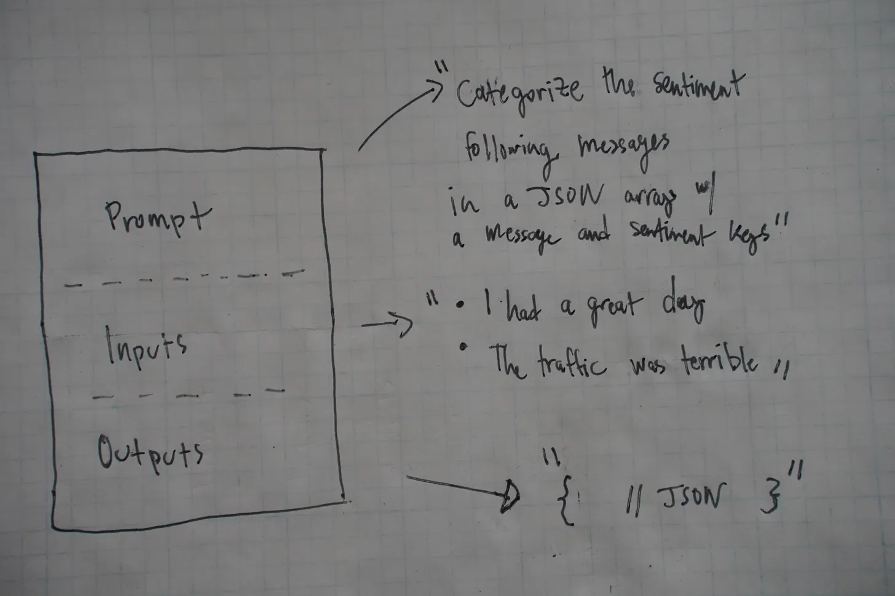

# RAG com watsonx usando o LangChain

Aplicações de IA generativa estão no dia a dia de todos nós. Seja no auxílio a geração de código rápido, auxílio na escrita de documentação e pequenas consultas do dia-a-dia (como as que eu fiz para gerar essa aula), modelos como o ChatGPT são muito úteis para problemas corriqueiros.

No entando, e se o seu problema for muito específico? Digamos que você queira desenvolver um sistema que transforme a consulta a uma documentação (por parte de um atendente, por exemplo) a uma conversa simples com um LLM.


Perguntar ao ChatGPT "Qual a taxa de juros do rotativo do cartão HelloCard para clientes gold?" não vai ter um retorno fiel, pois a documentação não está contemplada na base de conhecimento do LLM. Com isso, temos 2 alternativas: treinar/retreinar a LLM em cima das bases de conhecimento pertinentes ou fazer alguma técnica que expanda o contexto do modelo, de forma que suas respostas tragam conhecimento do contexto específico.

Essa solução deve:

1. Manter a estrutura conversacional da LLM, de forma que a interação continue sendo via chat;
2. Trazer respostas com base no contexto específico e somente nele;
3. Funcionar com base em qualquer tamanho de contexto, seja ele um manual simples ou toda a documentação de uma empresa dos últimos 30 anos.

Uma das formas de "embutir" esse contexto específico dentro da resposta da LLM é inserindo partes importantes da base de conhecimento dentro da **janela de contexto** da IA.


Fonte: https://blendingbits.io/p/llm-engineering-context-windows

Com isso, a nossa janela de contexto seria algo como:

```
Com base única e exclusivamente no texto abaixo, responda a seguinte pergunta: Qual a taxa de juros do rotativo do cartão HelloCard para clientes gold?

"Conforme norma de 20 de fevereiro de 2024, seguem as taxas de juros do cartão HelloCard:
- Clientes commom: 5%
- Clientes gold: 4% nos 3 primeiros meses e 4.5% até o fim do contrato
- Clientes PJ Premium: 8%"

Resposta: 
```

Sendo que a parcela entre aspas seria extraída diretamente da documentação e das normas do banco. A LLM geraria uma resposta com base nesse contexto e o atendente poderia ter a informção que busca muito mais rápido do que se precisasse consultar manualmente as bases de dados.

A última pergunta que fica é: como essa extração das informações pertinentes seria feita dentro de todo o domínio de informações? Como ela seria armazenada? Como integrar tudo em uma única solução?

Para resolver esse problema, existem as soluções de _Retrieval Augmented Search_ (RAG), que são um conjunto de técnicas que entregam esse tipo de aplicação. A próxima etapa dessa explicação encontra-se em [notebook.ipynb](notebook.ipynb)